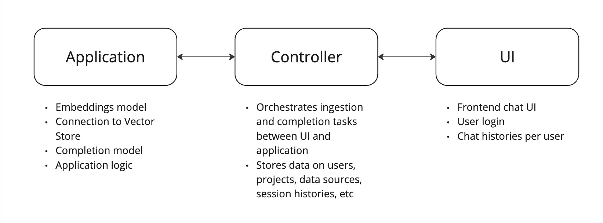

# GenAI Factory

Demo an end to end LLM agent solution with modular architecture, persistent storage and front-end UI that can work with various LLM models and storage solutions.

## Overview
The GenAI Factory is a flexible and scalable platform for building large language model (LLM) agents. It features a modular architecture, allowing users to easily swap out different LLM models and storage solutions as needed. The platform includes a user-friendly front-end UI, making it easy to interact with the LLM agent.



## Features
- Modular architecture for easy switching between LLM models and storage solutions
- Persistent storage options for local files or remote SQL and Vector databases
- Front-end UI for interacting with the LLM agent
- Configuration specified in YAML files for specifying model, embeddings, storage options, and other parameters
- Environment variables and credentials loaded from `.env` file or alternate path

## Getting Started

### Pre-Requisites
- Docker Desktop installed and updated
- Host networking enabled (see [Docker documentation](https://docs.docker.com/network/drivers/host/#docker-desktop) for more information)

### Deployment
1. **Deploy the controller and UI**:

    Run `make up` to start the API controller and UI in local Docker containers. If there are any port conflicts on your machine, update the ports in [docker-compose.yml](docker-compose.yml) and the URL's in [controller-config.yaml](controller/controller-config.yaml) as needed.

2. **Deploy an application**:

    Follow the [quick start](examples/quick_start/notebook.ipynb) to get up and running quickly. It will involve the following steps:
    1. Create a `.env` file which include OpenAI credentials
    2. Configure parameters in [workflow-config.yaml](examples/quick_start/workflow-config.yaml) as needed including embedding model, completion model, generation parameters, port changes, and more.
    3. Build your application in [workflow.py](examples/quick_start/workflow.py) using pre-defined components such as `SessionLoader`, `RefineQuery`, `MultiRetriever`, `HistorySaver`, `Agent`, and more.
    3. Deploy the application via `genai-factory run --config-file workflow-config.yaml workflow.py`
    4. Follow the [quick start](examples/quick_start/notebook.ipynb) for more details on how to ingest data and query the model via the UI.

### Configuration
There are three main types of configuration in the GenAI Factory:

1. **`.env`**:

    This is used to define credentials such as OpenAI API keys and define where to load [controller-config.yaml](controller/controller-config.yaml) and [workflow-config.yaml](examples/quick_start/workflow-config.yaml) files.

    Example:
    ```bash
    OPENAI_BASE_URL=...
    OPENAI_API_KEY=...
    GENAI_FACTORY_IS_LOCAL_CONFIG=true  # Set to 'true' for local configuration
    GENAI_FACTORY_LOCAL_CHROMA=/tmp/chromadb  # Path to local Chroma database (if applicable)
    ```

    **Note: These credentials are used by the application, not the controller.**

2. **`controller-config.yaml`**:

    This is used to configure the controller and specify the database type, connection string, application URL, and more.

    Example:
    ```yaml
    verbose: true
    log_level: DEBUG
    db_type: sql
    sql_connection_str: sqlite:////data/sql.db
    application_url: http://localhost:8000
    ```

    The data stored in the controller is not application specific, but rather relates to data sources, projects, users, session histories, etc.

3. **`workflow-config.yaml`**: 

    This is used to configure the application itself and specify embedding models, completion models, generation parameters, vector database storage, and more.

    Example:
    ```yaml
    chunk_overlap: 20
    chunk_size: 1024
    controller_url: http://localhost:8001
    controller_username: guest
    default_llm:
      class_name: langchain_openai.ChatOpenAI
      model_name: gpt-3.5-turbo
      temperature: 0
    default_vector_store:
      class_name: chroma
      collection_name: default
      persist_directory: /tmp/chromadb/chroma
    deployment_url: http://localhost:8000
    embeddings:
      class_name: huggingface
      model_name: all-MiniLM-L6-v2
    log_level: INFO
    project_name: default
    verbose: true
    workflows_kwargs: {}
    ```

    The application is responsible for the vector database persistence, configuration, and retrieval. It is also responsible for generations using the defined completion model.

## Full Controller CLI

To interact with the controller CLI, `docker exec` into the **controller container** and use the `python -m controller` CLI.

```shell
python -m controller --help

Usage: python -m controller [OPTIONS] COMMAND [ARGS]...

Options:
  --help  Show this message and exit.

Commands:
  config  Print the config as a yaml file
  infer   Run a chat query on the data source
  ingest  Ingest data into the data source.
  initdb  Initialize the database tables (delete old tables).
  list    List the different objects in the database (by category)
  update  Create or update an object in the database
```

For example, to ingest data from a website, run the following:
```bash
python -m controller ingest -l web https://docs.mlrun.org/en/stable/index.html
```
For more information, see the [quick start](examples/quick_start/notebook.ipynb).